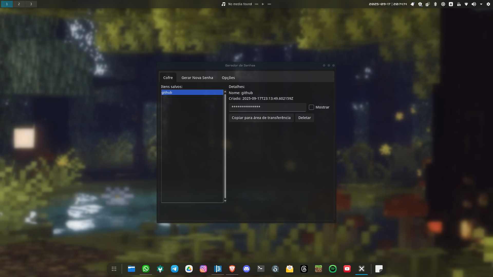

# 🔐 Gerador e Cofre de Senhas em Python

Este é um gerenciador de senhas simples e seguro, desenvolvido em Python com uma interface gráfica moderna usando Tkinter e o tema `sv-ttk`. Ele permite gerar senhas fortes e armazená-las de forma segura em seu computador ou em um dispositivo removível.



 
## ✨ Funcionalidades

- **Geração de Senhas Fortes**: Crie senhas com diferentes comprimentos, incluindo letras maiúsculas, minúsculas, números e símbolos.
- **Armazenamento Local**: As senhas são salvas em arquivos JSON em uma pasta no seu computador.
- **Detecção de Mídia Removível**: O programa prioriza salvar as senhas em um pendrive, se um for detectado, para maior portabilidade e segurança.
- **Interface Gráfica Moderna**: Interface limpa e agradável, com suporte a tema escuro e efeito de transparência (no Windows).
- **Cópia Rápida**: Copie senhas para a área de transferência com um único clique.

## 🚀 Como Usar

### 1. Pré-requisitos

- Python 3.x instalado.

### 2. Instalação

Clone este repositório e instale as dependências necessárias. A única dependência externa é o `sv-ttk` para a interface gráfica.

```bash

# Instale a dependência
pip install sv-ttk
```

### 3. Executando a Aplicação

Para iniciar o programa, execute o script `main.py`:

```bash
/bin/python /home/johnb/gerador-senhas-py/main.py
```

## 🔮 Próximos Passos

Atualmente, estou trabalhando para melhorar a detecção de pendrives e automatizar o processo de usá-los como o principal local de armazenamento. A ideia é que o programa possa ser executado diretamente de um pendrive, tornando-o totalmente portátil e ainda mais seguro. Fique ligado para futuras atualizações!

---
